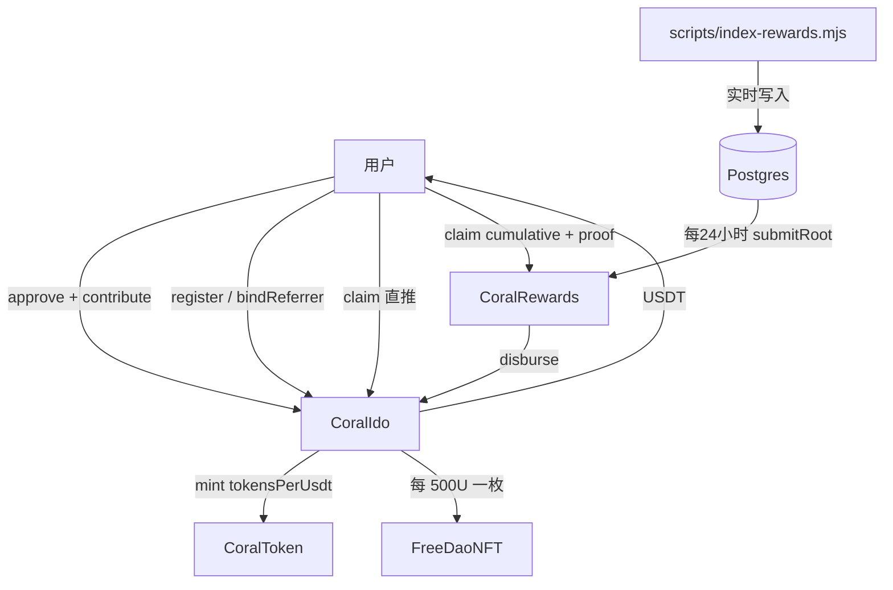

# coral 技术架构

日期：2026-09-23  
范围：链下网体结算。Foundry / Solidity 0.8.28。  
源码：`src/CoralIdo.sol`、`src/CoralRewards.sol`、`src/CoralToken.sol`、`src/FreeDaoNFT.sol`、`src/network/CoralNetworks.sol`

主网脚本已按 chainid `56` 配好，但没有 `ALLOW_MAINNET=true` 不会广播。主网仍需要外部审计。[SECURITY-AUDIT.md](SECURITY-AUDIT.md) 写的是上一版链上遍历模块，不覆盖本结构。

---

## 1. 拆分



| 合约 | 职责 |
|------|------|
| **CoralIdo** | USDT 金库：邀请、入金、直推、导入、铸 CKEY / NFT。`contribute` 不再沿邀请链循环 |
| **CoralRewards** | 累计 Merkle 是发奖依据。大约每 24 小时更新一次 root，用户提现时才转出 |
| **CoralToken** | `ckey / CKEY`。按需 mint，默认禁转 |
| **FreeDaoNFT** | 灵魂绑定。本人业绩每 500 USDT 一枚 |

链下计算器在 `scripts/lib/team-reward.mjs`，数字锁在 `scripts/fixtures/team-golden.json`。邀请关系留在链上，任何人都能复算。

zkVM 不在本期。挑战不接 UMA：押金 + 时间窗 + Owner 撤销或没收。

---

## 2. 生命周期

```
部署（NETWORK=local|bscTestnet|bscMainnet）
  → importUsers / importReferrers / importVolumes（只写本人业绩，不发奖）
  → freezeImport → openSale
  → register / contribute
  → 直推：用户 claim()
  → 索引：index-rewards.mjs 把业绩和累计网体奖写入 Postgres
  → 网体：publish-root.mjs → submitRoot → 挑战窗 → activateRoot → 用户 claim(proof)
```

`openSale` 必须已经 `freezeImport`。`closeSale` 后不能入金，直推 `claim` 仍可用，除非 `pause`。

---

## 3. 网络参数

`CoralNetworks.Params` 在部署时传入。`block.chainid` 不匹配则 `WrongNetwork`。

- **local 31337**：MockUSDT；timelock 60 秒；周为 30 个区块。
- **bscTestnet 97**：MockUSDT；timelock 1 小时；周为 1 小时时间戳。
- **bscMainnet 56**：USDT `0x55d398326f99059fF775485246999027B3197955`；timelock 24 小时；周为 7 天。

周参数只从这份配置读。`quote()` 用它计算历史序号，入金铸币不读 `quote()`。

---

## 4. CoralIdo

### 4.1 账户

```solidity
struct Account {
    address referrer;
    bytes32 inviteCode;
    uint256 selfVolume;
    uint256 directRewards;
    uint256 claimed;
    bool registered;
}
```

直推待领：`pendingOf = directRewards - claimed`。  
直推准备金：`directReserve = totalDirectAccrued - totalClaimed`。  
总准备金：`reservedRewards = directReserve + rewards.outstanding()`。  
`withdrawTreasury` 不能抽走准备金。`disburse` 只允许奖励合约调用，网体领取从当期 outstanding 里付，不能动直推准备金。

### 4.2 邀请

邀请码 1–32 位大写字母或数字，ASCII 左对齐。防环是 O(1)：已有下级就不能再绑上级。没有深度上限，因为入金不再遍历。

### 4.3 入金

1. `saleOpen`、已注册、`amount >= minIdo`（默认 1 USDT）
2. USDT 转入金库，`selfVolume += amount`
3. `amount >= 100 USDT` 时，直接推荐人记 10% 直推
4. `tokensFor(amount)` mint CKEY
5. 按 `selfVolume / 500e18` 补铸 NFT

深链和浅链的 `contribute` gas 在同一量级。NFT 仍按枚 mint，单笔 6 万 U 大约 120 次，这是另一笔 gas。

### 4.4 导入

`importVolumes(wallets, selfVolumes)` 只写本人业绩，并把 `nftMinted` 设成 `self / 500`，避免补铸历史 NFT。不写伞下业绩，不发直推，不发网体奖。

---

## 5. 链下极差

与已删除的链上团队模块同一套口径：

- 资格含本人。费率看本笔 bump 之前的资格。
- `prevBps` 从 0 起，入金者自己的档位不压缩上级。
- 先记极差，再把本笔业绩加进上级伞下，跨档从下一笔生效。
- 档位：500/3%、2k/5%、1 万/7%、3 万/9%、6 万/10%。
- 走完后，D 是最近的、本笔拿到团队奖且 bump 前已是 10% 的祖先；A 是 D 之上最近的另一个 10%。若 `dTeam > 0`，A 再拿 `dTeam` 的 10%。只抽一份。

验收数字在 `scripts/fixtures/team-golden.json`（含 ABCD 与两层 10% 抽成）。`node --test scripts/lib/*.test.mjs` 锁住这些数。

---

## 6. CoralRewards

叶子是 `(account, cumulative)`。OpenZeppelin 叶子：

`keccak256(bytes.concat(keccak256(abi.encode(account, cumulative))))`

配对哈希按 bytes32 数值排序。奇数节点直接上提，不复制。

- `claimed`：已经转出的 USDT。
- `rootAttributed`：已经用证明记入 root 的最高累计额。
- `outstanding = committed - rootPaid`。
- 领取只付 `cumulative - claimed`。用户不提现，合约不转账。
- `submitRoot` / `activateRoot` 要求累计合计 ≥ 已经支付的网体奖，并且直推 + 该合计 ≤ 25% 帽。
- 挑战押金放在奖励合约里。`cancelPending` 退回，`dismissChallenge` 转给 Owner。

---

## 7. CoralToken 与 FreeDaoNFT

- CKEY：CAP `1e9 * 1e18`，无预铸。默认禁转；`transferAllowlist` 放行。Owner 也可以 `mint`。
- NFT：仅金库 `mint(to, count)`，`_update` 禁止非零地址之间的转移。

---

## 8. 部署、导入、数百人

| 入口 | 作用 |
|------|------|
| `script/Deploy.s.sol` | `NETWORK=local\|bscTestnet\|bscMainnet`。主网需 `ALLOW_MAINNET=true` |
| `script/DeployLocal.s.sol` | 固定 local，给 `scripts/local-up.sh` 用 |
| `script/SeedLocal.s.sol` | 冻导入、开售、注册 `ROOTANVL` |
| `scripts/export-freedao.mjs` | `--network`。local / bscTestnet 写模拟地址和对照表 |
| `scripts/import-onchain.mjs` | 导入用户、邀请、本人业绩 |
| `scripts/index-rewards.mjs` | 实时把业绩和累计网体奖写入 Postgres |
| `scripts/publish-root.mjs` | 组 root；`--apply` 提交，`--activate` 到期生效 |
| `scripts/scale-anvil.mjs` | 约 300 个地址的真实交易、gas 对比、root 和领取 |
| `scripts/scale-network.sh` | local 会部署并跑；测试网缺密钥时只打印说明，不假装已经上链 |

`test/CoralScale.t.sol` 覆盖无上级、只直推、跨档、小于 100U、深浅 gas。`test/CoralRewards.t.sol` 覆盖错误 proof、timelock、挑战撤销、重复领取。`test/SimMarket.t.sol` 仍跳过，它描述的是旧三档，不作为本结构的验收。

---

## 9. 刻意未做

- zkVM 证明
- 接入 UMA
- 把 NFT 改成一次铸造多枚的省 gas 写法
- 董事 1%、33 席、脱离制、`bracketReward`
- 正式币兑换
- 本期广播 BSC 主网
