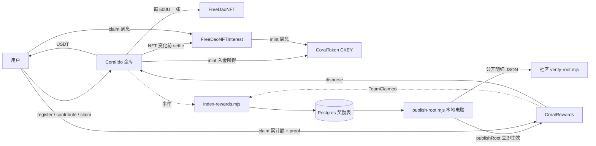
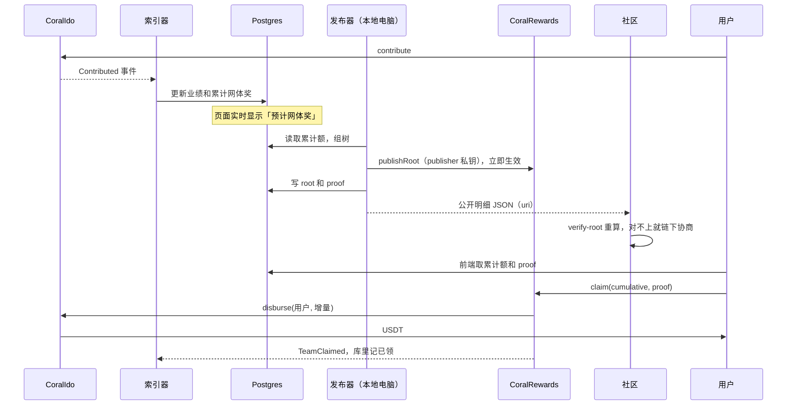

# coral 功能报告

日期：2026-09-24（第五版，链下修复并用真实 Postgres 验证之后）  
代码状态：提交 `11e8efd` 加上工作区全部未提交改动（分支 `localdev`）  
范围：`src/` 下全部合约、`script/Deploy.s.sol`、`scripts/` 下的链下计算、索引、发布、核对、导入和周界脚本  
配套安全报告：[SECURITY-AUDIT-2026-09-24-R6.md](SECURITY-AUDIT-2026-09-24-R6.md)。R5、R4、R3、R2 和第一版保留为历史

名称：项目与金库写 Coral，凭证写 CKEY，NFT 与周息写 FreeDaoNFT、FreeDaoNFTInterest。下文里仍出现的 `nemo()`、`NemoAllocated`、`nemo_*` 表、`NEMO_*` 变量和 `nemo-sim` 前缀，是链上选择器、已有表和导入算法的原名，没有改成另一套名字。

---

## 1. 系统总览

设计遵循三条原则：

1. **合约保持简单。** 金库只做入金、邀请、直推、铸币、导入和补发 NFT。
2. **用户的钱实时可取。** 直推奖在合约上记账，用户随时自己提现。网体奖的 root 一发布就能提现。
3. **网体奖在链下算。** 索引器把事件写进 Postgres 并实时计算。管理员在自己电脑上用 publisher 地址发布累计 Merkle root：默认每 7 天一次，也可以随时发布。社区用 `verify-root` 脚本核对公开明细，对不上就在链下协商、下一期更正。合约里没有挑战，也不会因此暂停提现。



### 1.1 角色与权限

| 角色 | 能做什么 | 不能做什么 |
|------|----------|------------|
| 用户 | 注册、绑定上级、入金、领直推、领网体奖、领 NFT 周息 | 改别人的数据；超过 25% 帽领网体奖 |
| 金库 Owner | 导入、冻结导入、开售、关售、结束 IDO、暂停、调参数、提走非准备金、切换奖励合约（首次之后要等延迟）、设置周息合约（一次）、给早期用户补发 NFT | 动用直推准备金和已发布未领的网体奖；补发超过导入张数；让 NFT 超过 1 万张 |
| 奖励合约 Owner | 指定 publisher、设置单次增量上限、自己也可以发布 root | 让直推加网体超过 25% 帽；把累计额设得低于已付总额 |
| publisher | 发布 root，发布即生效 | 改参数、提取资金 |
| 周息合约 Owner | 改周息档位（从当周起生效）、下调全站上限和单户上限 | 改已结束的周；单档每周超过 10%；全站上限超过 5000 万枚 |
| CKEY Owner | 设置铸币地址、周息铸币地址、转账白名单、直接铸币（早期用户本金） | 超过 10 亿枚 CAP |
| NFT Owner | 设置铸币地址（只能一次） | 转移任何人的 NFT |
| 社区 | 下载公开明细，用 `verify-root.mjs` 重算 root | 链上阻止发布（设计上没有这个入口） |

所有合约都用 `Ownable2Step`，可以转给多签。新 Owner 要调用 `acceptOwnership`。Owner 权限的风险清单见安全报告第 5 节，项目方已确认保留。

---

## 2. 合约函数

### 2.1 CoralIdo（金库）

继承 `Ownable2Step`、`Pausable`、`ReentrancyGuard`。常量：`REWARD_CAP_BPS = 2500`、`NFT_UNIT = 500e18`。构造时写入的不可变参数：`rewardsDelay`、`nftCap`。

**用户**

| 函数 | 条件 | 效果 | 事件 |
|------|------|------|------|
| `register(code, referrerCode)` | 未暂停；邀请码为大写字母或数字，且没人用过 | 登记邀请码；带上级码时同时绑定，并设置 `hasChildren[上级] = true` | `Registered` |
| `bindReferrer(referrerCode)` | 未暂停；已注册、还没绑定、自己没有下级 | 写入上级。「没有下级才能绑」保证了邀请树不会成环 | `ReferrerBound` |
| `contribute(amount)` | 未暂停；已开售、已注册、`amount ≥ minIdo` | 见下方步骤 | `Contributed`、`DirectRewardAccrued`、`NemoAllocated`、`NftMinted` |
| `registerAndContribute(...)` | 同上 | 没注册就先注册再入金；已注册时忽略传入的邀请码 | 同上 |
| `claim()` | 未暂停 | 把可领直推全部转给自己 | `Claimed` |

`contribute` 的步骤：

1. 收 USDT。
2. 本人业绩和全站总额增加。
3. 推荐人本人累计 ≥ 100U 时，给上级记 `amount × 10%` 直推。不到 100 不记，也不顺延。`minReferralAmount` 不再参与这笔判断。
4. 按 `tokensFor(amount)` 铸 CKEY，默认 1U = 100 枚。
5. 调用周息合约 `settle`，按旧张数结清已经结束的周。
6. 本人累计满 1000U 之后，按累计业绩 / 500 补铸 NFT。不满 1000U 不铸。若全站已达 1 万张上限，本期铸满剩余额度，超出的记为待发（`NftDeferred` 事件），入金不回滚。

**奖励合约专用**

| 函数 | 条件 | 效果 |
|------|------|------|
| `disburse(to, amount)` | 只有 `rewards` 地址能调；未暂停；有重入锁 | 余额扣掉直推准备金后够付才转出 | 

**Owner**

| 函数 | 说明 |
|------|------|
| `importUsers` / `importReferrers` / `importVolumes` | 冻结导入之前可用。只写地址、邀请码、上级和本人业绩。`importVolumes` 在累计满 1000U 时把 `importedNfts` 和 `nftMinted` 设为 `业绩 / 500` 并占用额度；不满 1000U 占 0 张。不铸 CKEY，也不铸 NFT |
| `grantNft(account, count)` | 给已导入的早期用户补发 NFT，累计不得超过 `importedNfts`。先按旧张数结清周息，再铸造 |
| `freezeImport` | 冻结导入，一次性。必须先冻结才能开售 |
| `openSale` | 开售。第一次开售时记录时间和区块，并通知周息合约从这一周开始计息 |
| `closeSale` | 只关闭入金，不影响周息。之后可以再次 `openSale` |
| `endIdo()` | 一次性。周息计到当前这一周为止（`idoEndedWeek = 当前周 + 1`）。**不会关闭入金**，要先 `closeSale` |
| `pause` / `unpause` | 挡住注册、绑定、入金、直推领取和网体付款。周息领取不受金库暂停影响，要暂停 CKEY 才能挡住 |
| `withdrawTreasury(to, amount)` | 最多提取 `treasuryWithdrawable` |
| `withdrawUnsoldNemo` | 取回金库里的 CKEY。正常流程下金库不持有 |
| `setDirectReferralBps` | 上限 2500 |
| `setMinReferralAmount` / `setMinIdo` / `setIdentityThresholds` | 门槛参数 |
| `setRewards(addr)` | 只能在第一次设置时用，立即生效 |
| `proposeRewards(addr)` → `acceptRewards()` / `cancelRewards()` | 之后更换奖励合约要先提议，等 `rewardsDelay` 后接受；等待期间可以取消 |
| `setNftInterest(addr)` | 只能设一次。若已经开售，立即通知周息合约开始计息 |
| `setTokensPerUsdt` / `setNemoSchedule` / `setNemoBonus` | 铸币比例。周递减只影响 `quote()` 的显示，实际铸造按 `tokensFor` 计算。周息用的比例要等周息合约调用 `setTiers` 才会更新 |

**只读：** `getAccount`、`pendingOf`、`referrerOf`、`directReserve`、`reservedRewards`、`treasuryWithdrawable`、`roleOf`（探索者、大使 ≥100U、合伙人 ≥1000U）、`currentWeek`、`tokensPer100`、`tokensFor`、`nftRemainder`、`nftDeferred`（达到 1 万张上限后待下一期发放的张数）、`quote`、`nftsAllocated`、`importedNfts`、`grantedNfts`、`idoEnded`、`idoEndedWeek`、`proposedRewards`、`proposedRewardsEta`。

### 2.2 CoralRewards（网体奖）

继承 `Ownable2Step`、`ReentrancyGuard`。不持有奖金，USDT 一直在金库里。没有挑战、押金、timelock 和垫付。

| 函数 | 调用方 | 说明 |
|------|--------|------|
| `publishRoot(root, contentHash, cumulative, uri)` | publisher 或 Owner | 立即生效。要求 `root ≠ 0`、`cumulative ≥ totalTeamPaid`、`totalDirectAccrued + cumulative ≤ 25% 帽`。设置了 `maxRootIncrease` 时，还要求 `cumulative ≤ committed + maxRootIncrease`。`uri` 指向公开明细 |
| `claim(cumulative, proof)` | 用户 | 验证叶子，支付 `cumulative − claimed[用户]`，再检查一次 25% 帽，然后由金库转出 |
| `setPublisher(addr)` | Owner | 更换发布地址。构造时默认等于 Owner |
| `setMaxRootIncrease(amount)` | Owner | 单次发布允许的最大增量，0 表示不限。**上线前要设置**（安全报告 R6-M1） |

**只读：** `merkleRoot`、`contentHash`、`contentUri`、`committed`、`claimed(addr)`、`totalTeamPaid`、`outstanding()`（`committed − totalTeamPaid`）、`rewardCap()`。

叶子格式和 OpenZeppelin 一致：`keccak256(bytes.concat(keccak256(abi.encode(地址, 累计额))))`。

### 2.3 FreeDaoNFTInterest（NFT 周息）

继承 `Ownable2Step`、`ReentrancyGuard`。IDO 期间按地址上实际持有的 NFT 张数计算 CKEY 周息，用户自己 `claim()`，合约铸给用户。

本金 = `NFT 张数 × 500U × 该周版本的 tokensPerUsdt`，默认 1U = 100 枚。

| 持有 | 每周 | 例子 |
|------|------|------|
| 少于 2 张 | 0 | — |
| 2 张（1000U） | 1% | 本金 10 万枚，每周 1000 枚 |
| 10 张（5000U） | 2% | 每周 1 万枚 |
| 20 张（1 万 U） | 2.5% | 每周 2.5 万枚 |
| 60 张（3 万 U） | 3% | 每周 9 万枚 |

落在两档之间时取已经达到的最高档。

**计息区间：** 从第一次开售的那一周开始，到 `endIdo` 所在的那一周为止（含这一周）。`closeSale` 不影响计息。

**周中变化：** 周中买入或补发的 NFT，当周整周按新张数计算，不按天折算。已结束的周在张数变化前就已结清，所以后买的 NFT 不会抬高以前的周。

**上限**

- 全站：`interestCap` 默认 5000 万枚（10 亿的 5%）。Owner 可以下调，不能调到 5000 万以上。到顶以后，超出的部分不计，也不留存。
- 单户：终身周息 ≤ `当前张数 × 500U × 最新比例 × accountCapBps`，默认 100%。

**档位修改：** `setTiers` 从当前这一周起生效，同一周内再次修改会覆盖这一版。最多 16 档，门槛严格递增，单档每周 1–10%。每个版本都记下当时的 `tokensPerUsdt`。

**周的划分**

- 主网（chainId 56）按北京时间自然周，截止于周日 00:00:00。每个周日只有一个跨越高度：区块 N 的时间是周六 23:59:xx，N+1 是周日 00:00:xx。合约按时间戳判断。`scripts/lock-interest-boundary.mjs` 用二分查找找出 N，有数据库时写入 `nemo_interest_boundary`，供公示。
- 本地和 BSC 测试网沿用金库的短周：本地 30 个区块，测试网 1 小时。

| 函数 | 调用方 | 说明 |
|------|--------|------|
| `claim()` | 用户 | 结算后把累计额全部铸给自己 |
| `pending(addr)` | 任何人 | 当前可领数量（含尚未结算的已结束周） |
| `settle(addr)` | 只有金库 | NFT 变化前结算 |
| `noteSaleOpened()` | 只有金库 | 记录起算周，只生效一次 |
| `setTiers` / `setInterestCap` / `setAccountCapBps` | Owner | 见上。分别发出 `TiersUpdated`、`InterestCapUpdated`、`AccountCapBpsUpdated` 事件 |
| `interestWeek(ts)` / `weekBoundary(week)` / `tiersOf(id)` | 任何人 | 周编号、主网周界时间、各版本档位 |

**早期用户：** 迁到主网时只导入地址、邀请码、上级和入金。CKEY 本金由 Owner 手动铸造；NFT 用 `grantNft` 补发。补发之前的周不计息，到账那一周起自动计息。

### 2.4 CoralToken（CKEY）

- 18 位小数，`CAP = 10 亿枚`，不预铸。
- 铸币方：金库（入金）、`interestMinter`（周息合约）、Owner（早期用户本金）。Owner 手动铸造的数量不计入金库的 `totalNemoAllocated`。
- 默认不可转。`transfersEnabled` 为 false 时，`from` 或 `to` 至少一方在白名单里才放行。Owner 调用 `setTransfersEnabled(true)` 后所有持有人都可以互转，再设为 `false` 则回到白名单规则。铸造和销毁不受这两项限制。
- `pause` 同时停止转账和铸造。暂停期间入金和领周息都会失败。
- `rescue` 可以取回误转进来的其他代币，不能取 CKEY 本身。

### 2.5 FreeDaoNFT

- 构造参数 `(owner, name, symbol)`。
- 只有金库能铸，编号自增，逐张铸造。
- `setMinter` 只能调用一次，之后不能更换铸币地址。
- 默认不可转。Owner 调用 `setTransfersEnabled(true)` 后持有人之间可以转，再设为 `false` 则重新锁上。铸造不受这个开关影响。周息按当前持有人的 `balanceOf` 计算。
- 周息由 `FreeDaoNFTInterest` 支付，这张合约里没有收益逻辑。

### 2.6 CoralNetworks（网络参数）

部署时传入。`CoralIdo` 和 `CoralRewards` 的构造函数都会检查 `block.chainid`，参数和链不一致就失败。

| 参数 | 本地 31337 | BSC 测试网 97 | BSC 主网 56 |
|------|-----------|---------------|-------------|
| USDT | 部署 MockUSDT | 沿用 `0x9E674AfE8C7c31DB30d4E2B93b524fe4302f0D57` | `0x55d398326f99059fF775485246999027B3197955` |
| 更换奖励合约延迟 `rewardsDelay` | 60 秒 | 10 分钟 | 24 小时 |
| NFT 上限 `nftCap` | 1 万张 | 1 万张 | 1 万张 |
| 一周 | 30 个区块 | 1 小时 | 7 天（周息按北京时间自然周） |
| 直推 / 最低入金 / 直推权益 | 10% / 1U / 推荐人本人累计 ≥ 100U | 同左 | 同左 |
| CKEY 比例 | 1U → 100 枚 | 同左 | 同左 |
| 大使 / 合伙人门槛 | 100U / 1000U | 同左 | 同左 |

---

## 3. 资金与准备金

```
入金 amount → 金库 USDT += amount
  直推：推荐人本人累计 ≥ 100U 时，directRewards += amount × 10%
直推领取  CoralIdo.claim()            → 金库转出
网体领取  CoralRewards.claim()        → vault.disburse → 金库转出
Owner 提取 withdrawTreasury          ≤ treasuryWithdrawable
NFT 周息  FreeDaoNFTInterest.claim()    → 新铸 CKEY，不动 USDT
```

| 量 | 公式 |
|----|------|
| 直推准备金 `directReserve` | `totalDirectAccrued − totalClaimed` |
| 网体未领 `outstanding` | `committed − totalTeamPaid`（当前 root） |
| 总准备金 `reservedRewards` | `directReserve + outstanding` |
| 可提（非准备金）`treasuryWithdrawable` | `USDT 余额 − reservedRewards` |
| 25% 帽 | `totalDirectAccrued + totalTeamPaid ≤ totalContributed × 25%`，常量，不能改 |

网体付款 `disburse` 只锁定直推准备金，所以即使 root 申报的累计额偏低，只要金库里还有钱，用户仍然能领到。

**没有链上保障的钱：** 链下已经算出、还没写进 root 的网体奖。它们能不能付出来，取决于 Owner 没有提前提走（安全报告 A-1）。root 的累计额由发布者申报，合约无法核对（A-2），由社区用 `verify-root` 事后核对。

---

## 4. 网体奖的生命周期



### 4.1 合约记账

| 变量 | 含义 |
|------|------|
| `claimed[a]` | 已经转给 a 的网体 USDT 累计额 |
| `committed` | 当前 root 申报的累计合计 |
| `totalTeamPaid` | 全站网体奖已转出总额 |

`claim` 的步骤：

1. 验证叶子。
2. 累计额低于 `claimed` 就失败；相等就报 `NothingToClaim`。
3. 检查 25% 帽。
4. 记账后由金库转出增量，发出 `TeamClaimed`。

同一片叶子领第二次不会再付钱。漏领几期也没关系：累计额只增不减，下一次领取时一次补齐。

### 4.2 从产生到能提现要多久

入金后，索引器在确认区块数（主网默认 15 个）之后写库，页面马上能看到预计金额。root 发布后立即可以提现，没有生效等待。默认每 7 天发布一次，管理员也可以随时发布，所以等待时间就是距离下一次发布还有多久。

---

## 5. 链下计算与数据库

### 5.1 计算规则（`scripts/lib/team-reward.mjs`）

- 拿奖人本人累计 ≥ 100U 才有直推和网体奖。不到 100 的直推是 0，也不占网体档位；凑满之后只计之后的新入金，不补以前的。下级这笔金额决定奖金多少，不决定有没有权益。
- 资格 = 本人业绩 + 伞下业绩，按本笔入金加进去之前的数值定档。
- 档位：500U / 3%、2000U / 5%、1 万 / 7%、3 万 / 9%、6 万 / 10%。
- 极差：沿上级链向上走，每人拿「自己的档位 − 下面已经发出的最高档位」。入金者自己的档位不参与，从 0 开始算。
- 6 万平级抽成：链上第一个达到 10% 的人（记为 D）拿到极差以后，再往上找最近的另一个 10% 祖先，给他 D 这笔网体奖的 10%。只做一次，不跳级。
- 导入的历史业绩只写本人业绩，不计入上级伞下业绩，不产生奖励，也不计入 25% 帽的分母（安全报告 R6-I4，请业务方确认）。

`scripts/fixtures/team-golden.json` 固定了 ABCD 和平级抽成的标准答案，`npm run test:js` 会对照检查。

### 5.2 事件映射（`scripts/lib/reward-index.mjs`）

| 事件 | 处理 |
|------|------|
| `Registered` / `UserImported` | 建账户；带上级时绑定 |
| `ReferrerBound` / `ReferrerImported` | 绑定上级 |
| `VolumeImported` | 设置本人业绩，不向上累计 |
| `Contributed` | 按 5.1 计算直推和网体奖 |
| `TeamClaimed`（需设置 `REWARDS_ADDRESS`） | 记录已领累计额 |

日志按（区块号，日志序号）排序后依次重放。

### 5.3 数据表（`scripts/lib/reward-db.mjs`，启动时自动建表）

| 表 | 主键 | 内容 |
|----|------|------|
| `nemo_indexer_state` | `chain_id, ido_address` | 已处理到的区块、奖励合约地址 |
| `nemo_team_account` | `chain_id, ido_address, wallet` | 上级、本人业绩、伞下业绩、累计网体奖、直推（显示用）、已领 |
| `nemo_team_root` | `chain_id, ido_address, root` | 每期 root、`contentHash`、累计合计、交易哈希、是否生效 |
| `nemo_team_proof` | `chain_id, ido_address, root, wallet` | 每个地址在每期 root 下的累计额和 proof |
| `nemo_interest_boundary` | 周编号 | 主网每周的截止区块 N |

金额都以 wei 字符串保存。账户表和检查点在同一个事务里写入。

同一条链上的两套金库（例如本期和雷迪森）可以共用一个库，读写都带 `IDO_ADDRESS`。旧表如果还是旧主键，脚本启动时会补上 `ido_address` 并更换主键。前端只展示 `active = true` 的 root；发布交易发出之前，这一期的 proof 先以未生效状态入库。

### 5.4 Merkle 与公开核对

- `scripts/lib/merkle.mjs`：和 OpenZeppelin `MerkleProof` 一致，叶子双重哈希，配对前排序，奇数节点直接上提。多叶子 proof 已在 Anvil 上被合约接受。
- `scripts/verify-root.mjs`：读取公开明细 `{root, contentHash, entries: [[地址, wei], ...]}`，重建树并与 root 对比，不一致时退出码为 1。任何人都可以运行，不需要私钥。

---

## 6. 部署与导入

| 入口 | 作用 |
|------|------|
| `script/Deploy.s.sol` | `NETWORK=local\|bscTestnet\|bscMainnet`。部署代币、NFT、金库、奖励合约、周息合约，并设置周息铸币地址。主网必须设置 `ALLOW_MAINNET=true` 才会广播 |
| `script/DeployLocal.s.sol` / `SeedLocal.s.sol` | 本地部署；冻结导入、开售、注册根邀请码 `ROOTANVL` |
| `scripts/export-freedao.mjs --network` | 本地和测试网用 `keccak("nemo-sim:网络:用户id")` 生成模拟地址并输出对照表；主网保留真实钱包 |
| `scripts/import-onchain.mjs` | 批量导入用户、上级和本人业绩；加 `--freeze` 时顺便冻结 |
| `scripts/scale-network.sh` / `scale-anvil.mjs` | 数百个账户实跑。测试网缺少密钥时只打印说明 |
| `scripts/export-deferred-nfts.mjs` | 导出达到 1 万张上限后待下一期发放的 NFT 名单（地址、上级、张数），供下一期导入和 `grantNft` 补发 |
| `scripts/e2e-postgres.sh` | 用 Docker 起临时 Postgres 和 Anvil，跑完「部署 → 索引 → 发布 → 核对 → 领取」后自动清理 |

**部署后需要人工做的事**

1. Owner 不是广播账户时，脚本不会调用 `setRewards` 和 `setNftInterest`，需要 Owner 自己调用。
2. 奖励合约：`setPublisher(专用地址)`、`setMaxRootIncrease(合理值)`。脚本目前不做这两步（R6-M1）。
3. 各合约转给多签以后，新 Owner 调用 `acceptOwnership`。

---

## 7. 日常运维

**用户**

- 领直推：调用 `CoralIdo.claim()`。
- 领网体奖：前端从数据库取累计额和 proof，用户调用 `CoralRewards.claim`，自己付 gas。
- 领 NFT 周息：调用 `FreeDaoNFTInterest.claim()`。页面用 `pending(address)` 显示可领数量。
- root 发布前，页面显示的是预计金额，不能提现。

**管理员**

| 步骤 | 命令 | 频率 |
|------|------|------|
| 1. 索引 | `npm run index:rewards`（加 `--follow` 常驻） | 发布前，或常驻 |
| 2. 预览 | `npm run publish:root`（默认只打印，不上链） | 发布前 |
| 3. 发布 | `node scripts/publish-root.mjs --apply`（本地电脑，干净终端，只设 `PUBLISHER_PRIVATE_KEY`） | 默认每 7 天，或随时 |
| 4. 公开明细 | 脚本自动写出 `roots/<链>-<金库>-<root>.json`，上传到 `CONTENT_URI` 指向的位置。这个网址会写进交易，要在发布前定好 | 每次发布 |
| 5. 核对 | `npm run verify:root -- 明细.json` | 任何人。对不上就要求下一期更正 |
| 6. 锁定周界 | `npm run interest:boundary` | 主网每个北京时间周日 0 点之后 |
| 7. 结束 IDO | 先 `closeSale`，再 `endIdo` | 一次 |

漏发几期不用逐期补，下一期 root 用的就是累计额。脚本缺少 `DATABASE_URL` 等变量时只打印说明，不会假装已经上链。

**注意事项**（详见安全报告）

- 发布前核对金库余额，够不够付出下一期的增量（A-1）。
- 发布脚本只读取 `PUBLISHER_PRIVATE_KEY`，并且会核对它等于链上的 `publisher()`。
- 索引从 `START_BLOCK` 开始，默认每 2000 个区块写一次检查点。索引和发布不能同时跑，后启动的那份会跳过。
- 应急时同时暂停金库和 CKEY，才能挡住周息领取（R6-L3）。

---

## 8. 测试与实测

| 项 | 结果 |
|----|------|
| Forge | 120 项通过，1 项跳过（SimMarket 大规模模拟）。其中奖励合约 8 项、NFT 周息 14 项、R3 复现 16 项、R5 复现 8 项 |
| JS | 21 项通过：极差标准答案、Merkle、地址映射、导入树、事件重放、北京时间周界、verify-root、分段扫描、按金库地址建表 |
| 覆盖率（行 / 分支） | CoralIdo 88.6% / 41.5%；CoralRewards 100% / 53.9%；FreeDaoNFTInterest 98.5% / 64.3%；CoralToken 100% / 45.5%；FreeDaoNFT 100% / 42.9% |
| 300 账户 Anvil 实跑（本轮重跑） | 300 个账户、299 笔入金；1000U 入金 gas 深浅链都是 329,747；58 个账户有网体奖，合计 11,507.5U；`publishRoot` 发布后多叶子 proof 领取成功 |
| 真实 Postgres 端到端（`npm run e2e:postgres`，需要 Docker） | 旧表自动迁移；分段索引 600 条日志；拒绝 `PRIVATE_KEY` 和非 publisher 私钥；先写库再发布；公开文件通过 `verify-root`，改 1 wei 就失败；重复发布仍只有 1 期生效；用库里的 6 层 proof 领到 6U，链上和库里已领金额一致；重复领取被拒；并发锁生效 |
| NFT 开销 | 每 500U 一张，逐张铸造；6 万 U 单笔约 120 张，此前实测约 341 万 gas |
| BSC 测试网 | 未广播（本机没有 `BSC_TESTNET_RPC` 和 `PRIVATE_KEY`） |
| Slither 0.11.6 | 31 条：1 条高是误报，8 条中都不构成问题，缺事件的 2 条已修。逐条分析见安全报告第 4 节 |

分支覆盖率偏低，主要是各类 revert 分支没有测到。

---

## 9. 本期不做

zk 证明、接入 UMA、NFT 批量铸造、董事 1% / 33 席 / 脱离制度、正式币兑换、雷迪森新金库与邀请关系继承、BSC 主网广播。
